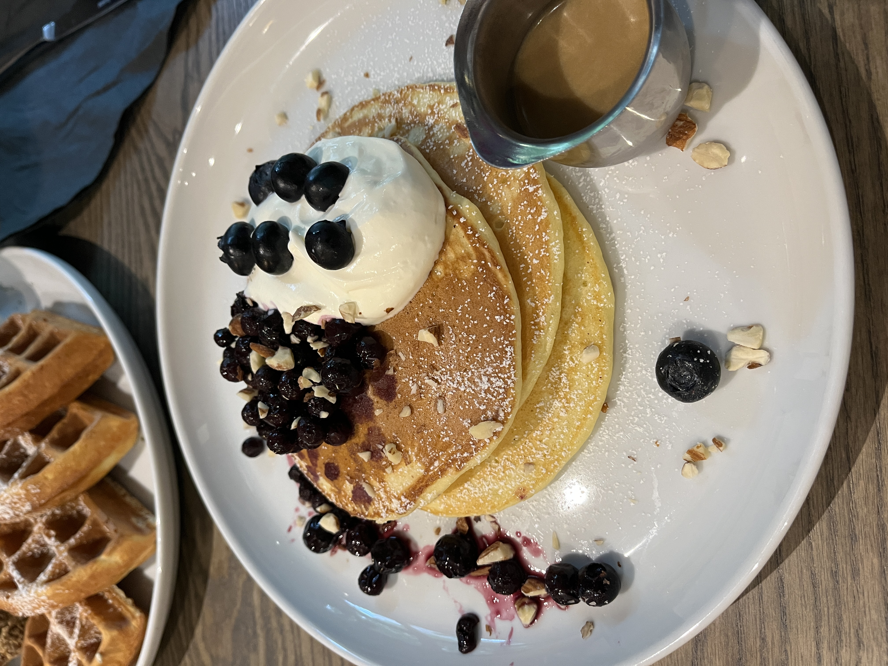
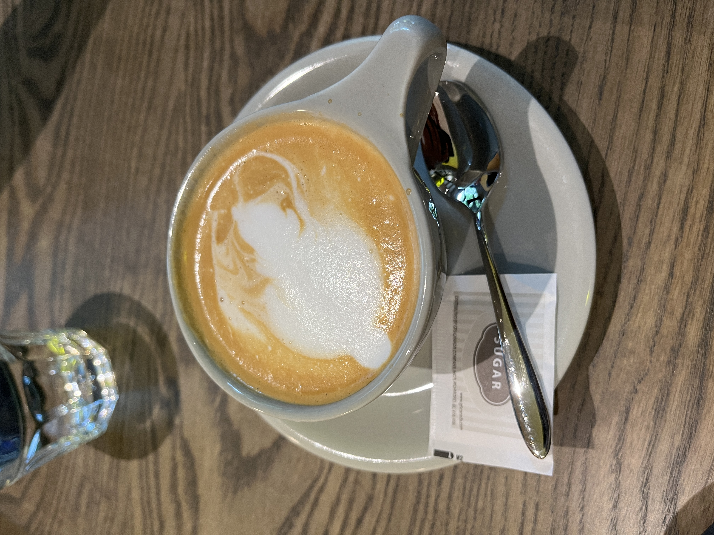
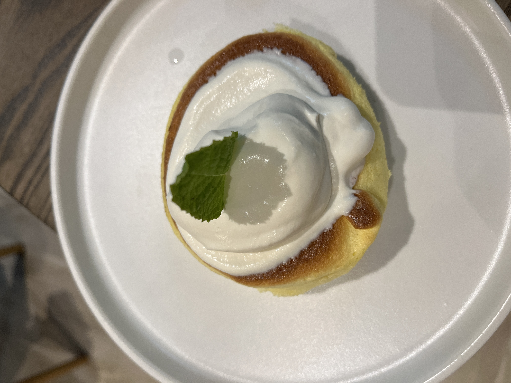
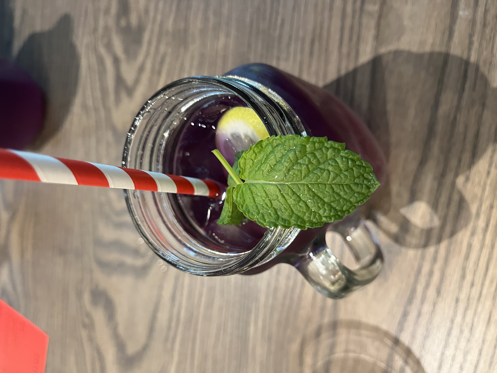
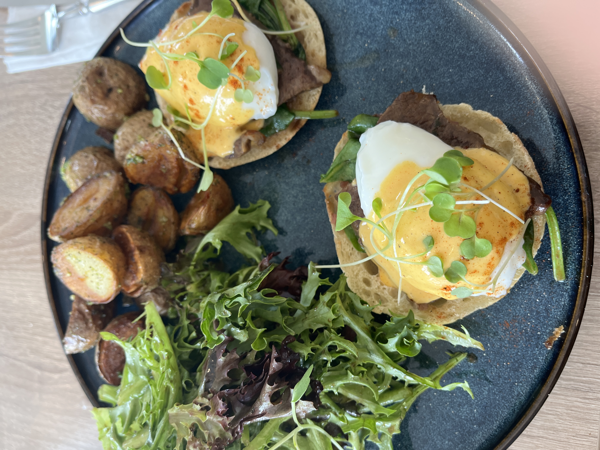
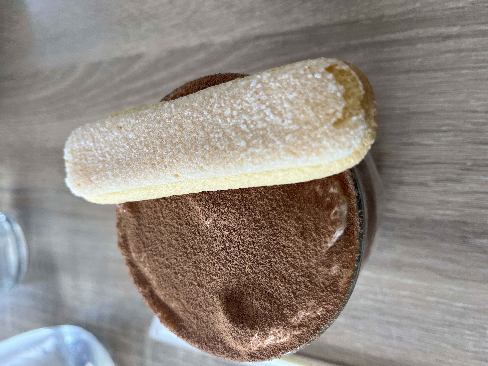

# Breakfast/Brunch

## Flippers
**Date:** 02/06/2024

&nbsp;

**Dish Name:** Blueberry Cream Cheese Pancake\
**Dish Review:** The pancake was pretty standard. Was not super fluffy or absorbent. The cheese creams was, good balance of cheesy and creamy mix. The syrup was good. Tasted like a caramel syrup mixture. The berries felt they were frozen and thawed. And a bit watery.  Think it would have been nice to have just frozen blue berries. The nuts were a nice touch could have added more. \
**Dish Rating:** 7.4/10

----

**Dish:** Cappuccino \
**Dish Review:**  Was overly bitter. Felt the milk was very littler or light. The foam wasn’t as creamy. No roasted coffee feeling. Maybe it was a bit rushed. Wasn’t the biggest fan of it. \
**Dish Rating:** 4.5/10

----

**Dish Name:** Signature Flippers Soufflé Pancake\
**Dish Review:**  The pancake was very fluffy and nice to cut into, but there was a taste of egg which I wasn’t a fan of. The cream was good and good balance to the fluffy cake.\
**Dish Rating:** 5.3/10

----

**Dish Name:** Blue Ice Tea Lemonade \
**Dish Review:**  It’s not too bad it grows on you kind of thing but has an odd after taste. Sort of cinnamon like. Not sure what the berry was\
**Dish Rating:** 6.2

Was a bit of a long wait but was the opening weekend so busy. (-.15). Server was nice but did not know soufle pancake were not available even though hostess said it was not

They gave out free tote bag cause it was opening weekend. The gave sample soufle pancakes to try.

Friend got waffle and friend chicken. Had a small bite of the chicken, was really good.

**Restraunt Rating:** 6.35/10 \
**Overall Price:** 32.21 (36.21)

## KarKumi Cafe
**Date:** 01/08/2024

&nbsp;

**Name:** Beef Short Rib Eggs Benedict\
**Review:** They had a bit too many greens. The greens had some sweet flavoring which is good by itself but mixing it with the other dish times didn’t go too well. The wedges were pretty well baked and well seasoned. But they weren’t evenly seasoned so some were more and less seasoned. The eggs Benedict was really good and had nice taste to it. I liked the beef a lot too. The bread was kind of soggy which I didn’t like, but could have been due to how long I left it. \
**Rating:** 8.6/10

----

**Name:** Tiramisu Latte\
**Review:**  actually pretty good. Came with a biscuit which tasted good dipped in. The coffee is decently flavored and not too bitter. It’s really just cold brew with whipped cream and flavored sugar\
**Rating:** 6.8/10

**Restaurant Vibe:** The restaurant has small cafe vibe. Very clean and very well kept. Not much personality more a modern look to
It. The washroom is pretty okay. It is clean and  well kept. It had a glow light mirror. The cutlery is fancy. Really good presentation of food. My dish came pretty quickly. But we were a group and it took some time for others to come by, but that could have been cause he had issues ordering. They used a digital menu you order through their website instead.  Pretty good no waiter needs to come to your table and order when ready. Not all dish item has prices. They did not force tip for big group and minimum tip was 12%\
**Restaurant rating:** 8.9/10\
**Overall Price:** $32.91 (12%) tip

&nbsp;

#Reviews/Food
