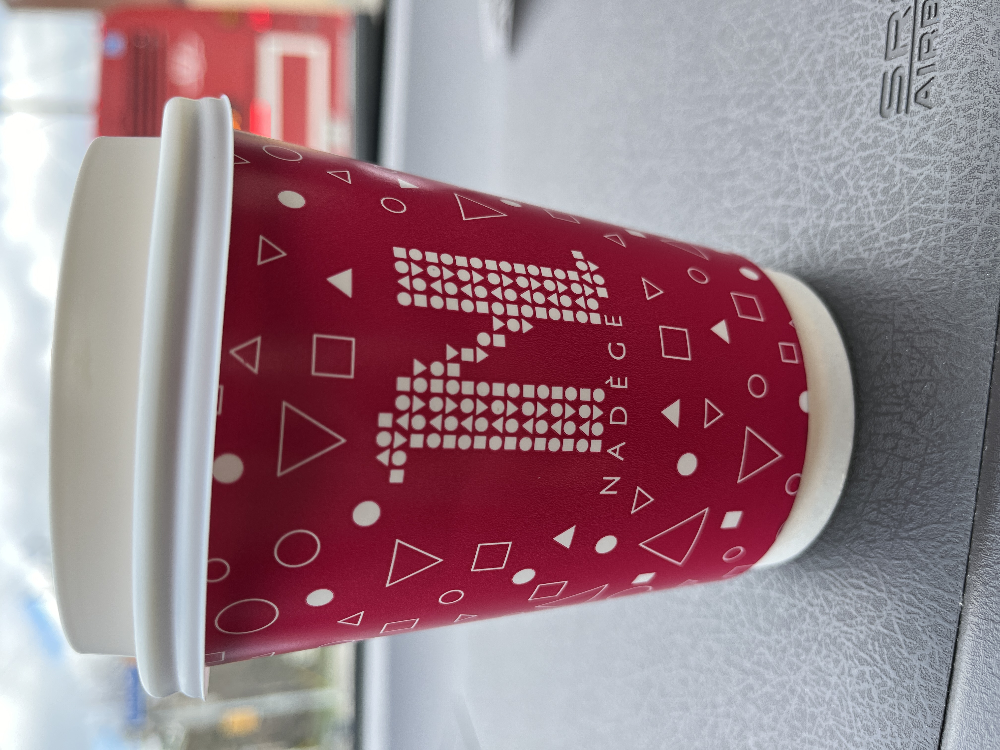
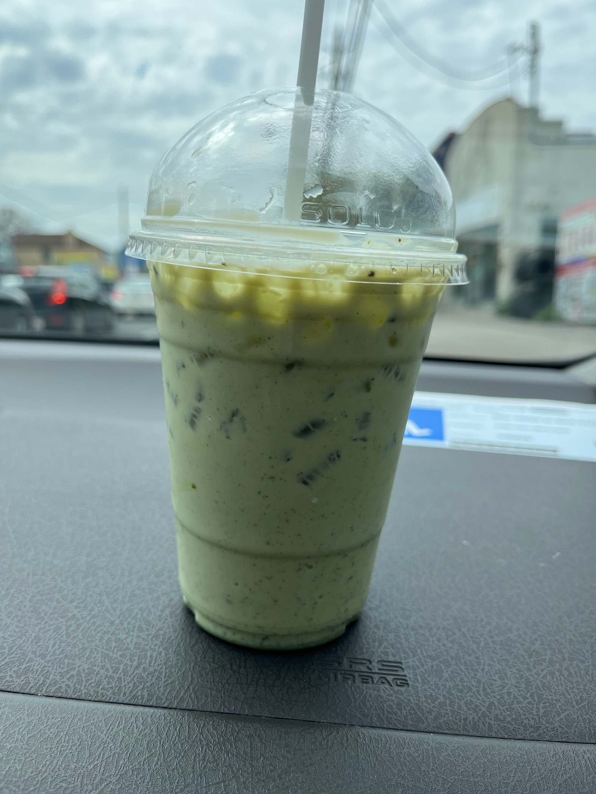
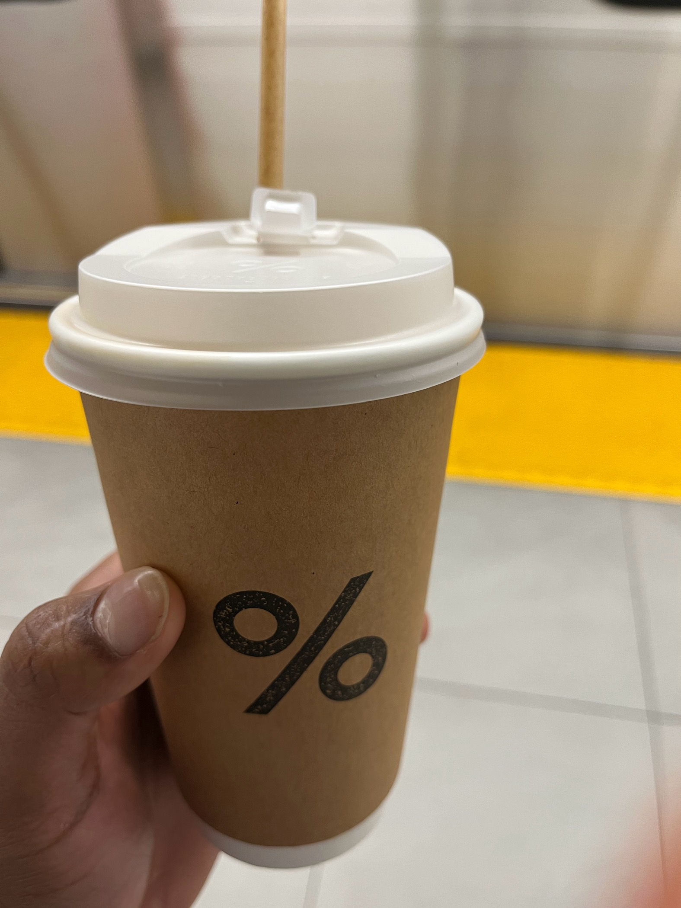
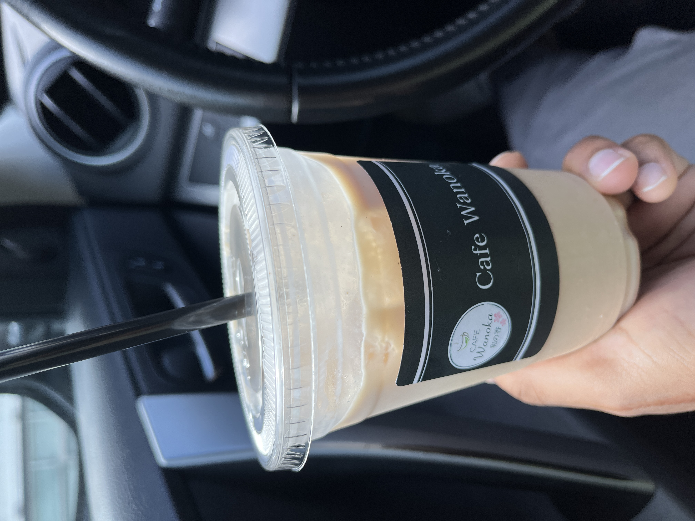

# Coffee

## Nadege

**Location**: [780 Queen St W, Toronto, ON M6J 2R5](https://maps.app.goo.gl/wbNoickJcBW6bZJ28)  \
**Date:** N/A

**Name:** Americano with a bit of cream\
**Review:** It was really bad, the thing that you would necer want to get again kind of bad. It tasted worse than black coffee, idk how that is even possible. I will give that no one is coming here for the coffee, but why is it on the menu if it is that bad.I would come back for their pasteries and ice cream but coffee idk.\
**Rating:** 2/10

----

**Restaurant Vibe:** The restaurant it self has a really nice clean vibe to it. It is mostly a pastry shop and it is small. It has two sections, one for ice cream and one for their pasteries, they both have separate entrances. I have been here a few times before and tried out other menu items.\
**Additional Notes:** N/A\
**Restaurant rating:** 5/10 \
**Overall Price:** $4.00

<ins>**Quick Review Summary**</ins>

|Food Rating (100) | Restaurant rating (100)| Second Visit Chance (%)| Cost| Worth | Would Recommend|
|:----------------:|:----------------------:|:----------------------:|:----:|:----:|:--------------:|
|      20          |         50             |         85             | $$   |No|    No      |

&nbsp;

## Ethio Natural Coffee

**Location**: [3224 Danforth Ave, Scarborough, ON M1L 1C1](https://maps.app.goo.gl/1YXWpLxz4L7cskuf9)  \
**Date:** 04/08/2024

**Name:** Matcha Iced Latte\
**Review:** 5.5/10\
**Rating:** It felt it was not super well mixed. There was a strong bitter taste in the beginning. After mixing it myself, there was a subtle matcha tast to it and that was nice. They used small ice cubes and if you don't ask for less ice the pack the cups is packed with ice like a full cup of. The latte itself had some graininess to it which really was off putting to the texture.

----

**Restaurant Vibe:** The restaurant is nice, it feels more authentic than those modern cafes, they have (I believe) ethiopean artwork on the walls, and it feels more homey cafe vibe.\
**Additional Notes:** I would like to try their other menu items\
**Restaurant rating:** 7/10\
**Overall Price:** $6.18

<ins>**Quick Review Summary**</ins>

|Food Rating (100) | Restaurant rating (100)| Second Chance (%)| Cost| Worth | Would Recommend|
|:----------------:|:----------------------:|:----------------------:|:----:|:----:|:--------------:|
|      55          |         70             |         85            | $$$ |No|    No      |

&nbsp;

## %Arabica

**Location**: [65 Front St W, Toronto, ON M5J 1E6](https://maps.app.goo.gl/p1xSL2KJE8RZfR8W6) (Inside Union Station)  \
**Date:04/05/2024**

**Name:** Kyoto Iced Latte\
**Review:** The latter was okay, nothing that would blow you out with the taste the way the atmosphere gives you, but also not too bad. There were bit of syrup which could have been because it was not mixed properly, but haveing the bursts of syrup added a nice touch to it.\
**Rating:** 7/10

----

**Restaurant Vibe:** The place is more about the atomosphere and look and feel than the coffee in particular. The restaurant is all white with mix of coffee like colors. But even though it is supposed to have a pristine look it not super clean and well kept.\
**Restaurant rating:** 5/10\
**Overall Price:** $7.85

<ins>**Quick Review Summary**</ins>\

|Food Rating (100) | Restaurant rating (100)| Second Chance (%)| Cost| Worth | Would Recommend|
|:----------------:|:----------------------:|:----------------------:|:----:|:----:|:--------------:|
|      70         |         50            |         90            | $$$ |No|    Yes      |

&nbsp;

## Cafe Wanoka

**Location**: [2101 Brimley Rd, Scarborough, ON M1S 2B4](https://maps.app.goo.gl/KZYGwouGWwACKBpY6) \
**Date:** 06/06/2024

**Name:** Iced Black Honey Kinako Latte\
**Review:** Overall it had a good taste to it. Very light amount of sweetness. There was very slight bit graininess to it but it worked with the latte\
**Rating:** 7.9/10

----

**Restaurant Vibe:** Very small cafe, has a more modern feel rather than authenticness to it. I feel it is supposed to be a japanese cafe but it just feels like any other cafe. I would come to try other menu items\
**Restaurant rating:** 5/10\
**Overall Price:$** $7.85

<ins>**Quick Review Summary**</ins>

|Food Rating (100) | Restaurant rating (100)| Second Chance (%)| Cost| Worth | Would Recommend|
|:----------------:|:----------------------:|:----------------------:|:----:|:----:|:--------------:|
|      79         |         50            |         90            | $$$ |No|    Yes      |

&nbsp;

#Reviews/Drinks
